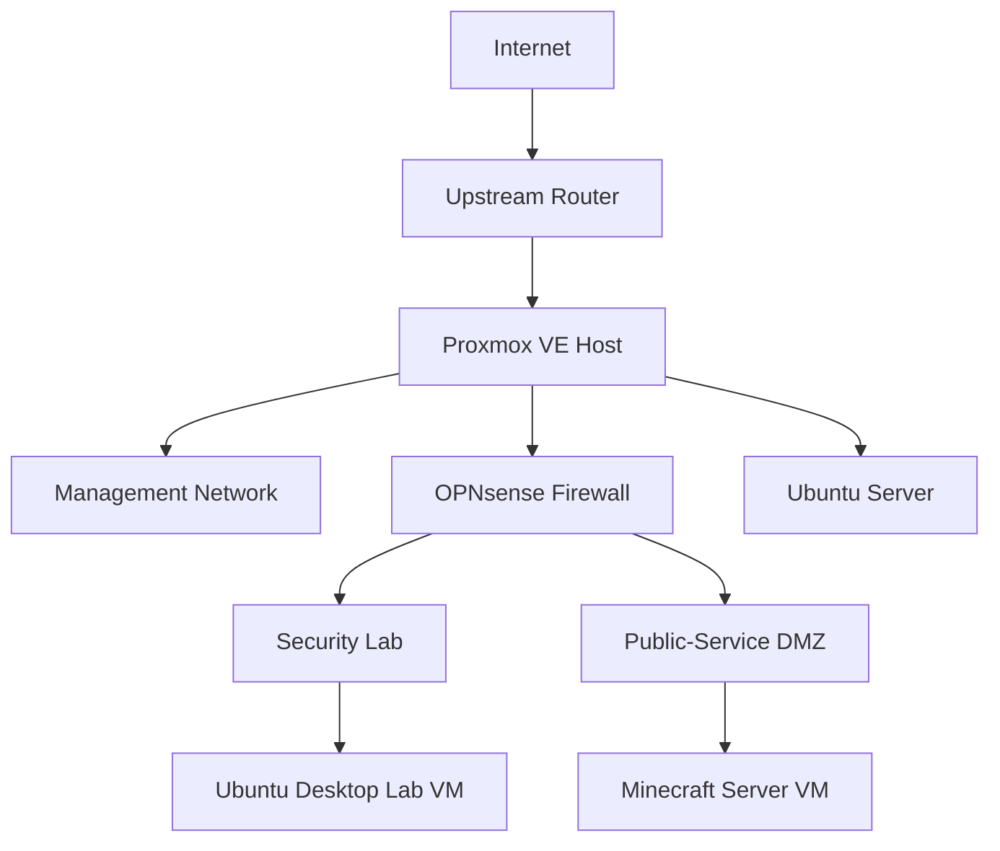

# Homelab Infrastructure

A hands-on Proxmox-based homelab built to practice virtualization, Linux administration, networking, firewalling, server administration, and cybersecurity.

This repository documents the architecture, security model, troubleshooting process, and technical skills developed while building and operating the lab.

> This is a sanitized public portfolio. Operational secrets, public IP addresses, MAC addresses, credentials, private keys, exact location information, and sensitive configuration exports are intentionally excluded.

## Architecture



The design uses separate trust zones for infrastructure management, cybersecurity experimentation, and internet-facing services.

## Highlights

- Built and administered a **Proxmox VE** virtualization host
- Deployed **OPNsense** as a virtual firewall/router
- Configured segmented networks using **managed switching, VLAN concepts, Linux bridges, routing, DHCP, NAT, and firewall rules**
- Created a dedicated **security-lab network** isolated from management systems
- Built a separate **DMZ for a public-facing Minecraft server**
- Deployed and managed **Ubuntu Server** workloads
- Configured persistent Linux storage with **ext4 and /etc/fstab**
- Created **systemd** services for application management
- Hardened public-facing services by reducing exposed ports and separating trust zones
- Troubleshot routing, DHCP, interface naming, firewall ordering, NAT, and Linux service issues

## Documentation

| Area | Documentation |
|---|---|
| Architecture | [Architecture Overview](docs/architecture.md) |
| Networking | [Networking and Segmentation](docs/networking.md) |
| Firewall | [OPNsense](docs/opnsense.md) |
| Virtualization | [Proxmox](docs/proxmox.md) |
| Hardware | [Hardware](docs/hardware.md) |
| Minecraft | [Minecraft Server](docs/minecraft.md) |
| Security | [Security Controls](docs/security.md) |
| Troubleshooting | [Troubleshooting Notes](docs/troubleshooting.md) |
| Skills | [Skills Demonstrated](docs/skills-demonstrated.md) |
| Future Work | [Roadmap](docs/roadmap.md) |

## Security Model

The lab follows a segmented design rather than placing all systems on one flat network.

```text
Management Network
    |
    | isolated
    |
Security Lab -------- blocked --------> Management
    |
    | separate trust zone
    |
Public-Service DMZ --- blocked --------> Management / Security Lab
```

Public-facing workloads receive only the network access required for their function. Hypervisor and firewall-management interfaces are not intentionally exposed to the public internet.

## Technologies

**Virtualization:** Proxmox VE  
**Firewall/Router:** OPNsense  
**Operating Systems:** Ubuntu Server, Ubuntu Desktop  
**Networking:** Managed Ethernet switching, VLAN concepts, Linux bridges, DHCP, NAT, firewall policy  
**Administration:** Linux CLI, SSH, systemd, journalctl, filesystem management  
**Security:** Network segmentation, DMZ design, least privilege, service hardening  
**Services:** Paper Minecraft server, GrimAC anti-cheat

## Project Purpose

The goal of this lab is to move beyond classroom-only concepts and gain practical experience designing, configuring, breaking, troubleshooting, and securing real systems.

The environment is intentionally evolving as new services, monitoring, automation, storage, and cybersecurity exercises are added.

## Planned Work

- Automated backups
- Centralized logging and SIEM
- Windows Server / Active Directory
- Additional isolated security-testing systems
- Ansible configuration automation
- Network and service monitoring
- Local AI-assisted administration
- Expanded recovery and disaster-recovery documentation
